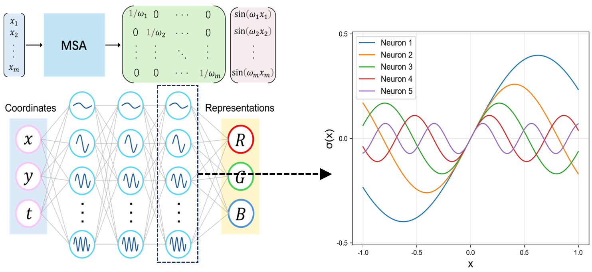

# MSA-INR



**MSA-INR** is a lightweight PyTorch package for using **Multi-Scale Sine Activation (MSA)** in implicit neural representation (INR) models.

This package provides a simple implementation of the activation function proposed in our AAAI 2026 paper:

**Implicit Neural Representation with Multi-Scale Sine Activation**  
Jufeng Han, Shu Wei, Min Wu, Lina Yu, Weijun Li, Linjun Sun, Hong Qin, and Yan Pang  
*Proceedings of the AAAI Conference on Artificial Intelligence*, 40(26): 21567–21575, 2026.  

Paper link: [https://ojs.aaai.org/index.php/AAAI/article/view/39305](https://ojs.aaai.org/index.php/AAAI/article/view/39305)

---

## Introduction

Implicit Neural Representations (INRs) model continuous signals using neural networks that map coordinates to signal values. They have been widely used in image representation, video representation, 3D shape modeling, neural fields, and scientific computing.

However, standard multilayer perceptrons often suffer from **spectral bias**, meaning that low-frequency components are learned more easily than high-frequency details. This limitation makes it difficult for conventional INRs to accurately represent signals with fine structures and multi-scale patterns.

To address this problem, we propose **Multi-Scale Sine Activation (MSA)**. MSA introduces logarithmically spaced multi-scale sinusoidal transformations into the activation function, allowing different hidden channels to respond to different frequency scales. This design improves the spectral expressivity of INR models while keeping the network structure simple and efficient.

In the AAAI 2026 paper, MSA is evaluated on multiple implicit representation tasks, including 1D multi-scale function fitting, image representation, video representation, 3D shape representation, and PDE solving.

---

## Installation

Install from PyPI:

```bash
pip install msa-inr
```

Upgrade to the latest version:

```bash
pip install -U msa-inr
```

Or install from source:

```bash
git clone https://github.com/your-username/MSA_INR.git
cd MSA_INR
pip install -e .
```

---

## Quick Start

### Use MSA as an activation function

```python
import torch
from msa_inr import MSA

activation = MSA(s_min=1.0, s_max=5.0)

x = torch.randn(8, 256)
y = activation(x)

print(y.shape)
```

---

### Use MSA-INR network

```python
import torch
from msa_inr import MSANet

model = MSANet(
    in_features=2,
    hidden_features=256,
    hidden_layers=3,
    out_features=1,
    s_min=[1.0, 1.0, 1.0],
    s_max=[5.0, 5.0, 5.0],
)

coords = torch.rand(1024, 2)
pred = model(coords)

print(pred.shape)
```

---

### Use `get_model`

```python
from msa_inr import get_model

model = get_model(
    in_features=3,
    hidden_features=256,
    hidden_layers=2,
    out_features=1,
)
```

---

## Method Overview

Given an input tensor with feature dimension `C`, MSA constructs a set of log-spaced frequencies:

```text
freqs = logspace(s_min, s_max, steps=C)
```

and applies a channel-wise sinusoidal transformation:

```text
MSA(x) = (1 / freqs) * sin(freqs * x)
```

In this way, different hidden channels are associated with different frequency responses. Low-frequency channels help capture smooth structures, while high-frequency channels improve the representation of fine details and rapidly varying components.

This makes MSA suitable for implicit neural representation tasks where both global structure and local high-frequency details are important.

---

## API Reference

### `MSA`

```python
MSA(s_min=1.0, s_max=5.0)
```

Multi-Scale Sine Activation with log-spaced frequencies.

#### Parameters

| Parameter | Type | Default | Description |
|---|---:|---:|---|
| `s_min` | float | `1.0` | Lower exponent of the log-spaced frequency range |
| `s_max` | float | `5.0` | Upper exponent of the log-spaced frequency range |

#### Example

```python
import torch
from msa_inr import MSA

act = MSA(s_min=1.0, s_max=5.0)

x = torch.randn(16, 128)
y = act(x)

print(y.shape)
```

---

### `MSANet`

```python
MSANet(
    in_features=3,
    hidden_features=256,
    hidden_layers=2,
    out_features=1,
    s_min=None,
    s_max=None,
)
```

A simple INR network using MSA layers.

#### Parameters

| Parameter | Type | Default | Description |
|---|---|---:|---|
| `in_features` | int | `3` | Input coordinate dimension |
| `hidden_features` | int | `256` | Hidden layer width |
| `hidden_layers` | int | `2` | Number of hidden MSA layers |
| `out_features` | int | `1` | Output dimension |
| `s_min` | float, list, or None | `None` | Lower frequency exponents for each hidden layer |
| `s_max` | float, list, or None | `None` | Upper frequency exponents for each hidden layer |

If `s_min` and `s_max` are not specified, the default setting is:

```python
s_min = [1.0] * hidden_layers
s_max = [5.0] * hidden_layers
```

A scalar value is also supported:

```python
model = MSANet(hidden_layers=3, s_min=1.0, s_max=5.0)
```

which is equivalent to:

```python
model = MSANet(
    hidden_layers=3,
    s_min=[1.0, 1.0, 1.0],
    s_max=[5.0, 5.0, 5.0],
)
```

---

## Example: Fitting a 2D Signal

```python
import torch
import torch.nn as nn
from msa_inr import MSANet

# Coordinate input: [N, 2]
coords = torch.rand(4096, 2)

# Target signal
target = torch.sin(20 * coords[:, :1]) * torch.cos(20 * coords[:, 1:2])

model = MSANet(
    in_features=2,
    hidden_features=256,
    hidden_layers=3,
    out_features=1,
    s_min=[1.0, 1.0, 1.0],
    s_max=[5.0, 5.0, 5.0],
)

optimizer = torch.optim.Adam(model.parameters(), lr=1e-4)
criterion = nn.MSELoss()

for step in range(1000):
    pred = model(coords)
    loss = criterion(pred, target)

    optimizer.zero_grad()
    loss.backward()
    optimizer.step()

    if step % 100 == 0:
        print(f"Step {step}, Loss: {loss.item():.6f}")
```


## Citation

If you use this package or the MSA activation function in your research, please cite our paper:

```bibtex
@inproceedings{han2026implicit,
  title={Implicit Neural Representation with Multi-Scale Sine Activation},
  author={Han, Jufeng and Wei, Shu and Wu, Min and Yu, Lina and Li, Weijun and Sun, Linjun and Qin, Hong and Pang, Yan},
  booktitle={Proceedings of the AAAI Conference on Artificial Intelligence},
  volume={40},
  number={26},
  pages={21567--21575},
  year={2026},
  doi={10.1609/aaai.v40i26.39305}
}
```

---

## License

This project is released under the MIT License.

---

## Contact

For questions, issues, or suggestions, please open an issue in the GitHub repository.

You can also contact us by email: hanjufeng@semi.ac.cn
